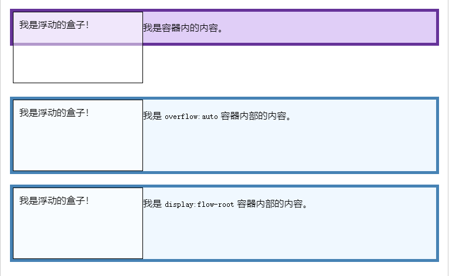
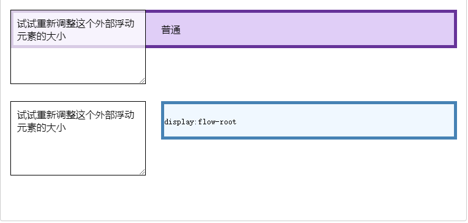
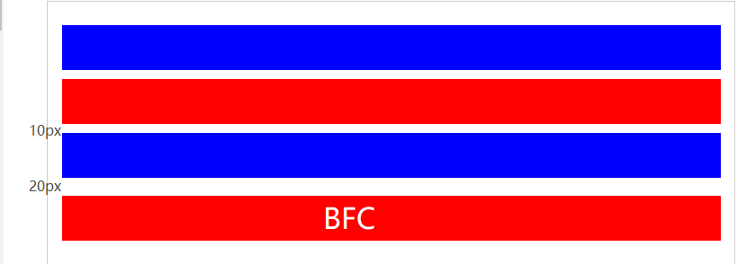

# BFC 块
BFC 块是 CSS 中的重要知识点，英语全称 Block formatting contexts，翻译成中文就是“**块级格式化上下文**”。本文将对其规则，作用进行研究，并简单介绍 IFC、GFC 和 FFC。

## 什么是 BFC 块
首先，它和 KFC 没有任何关系。  
其次，它和 KFC 没有关系。  
最后，它和KFC 没有关系。

**BFC（Block formatting contexts）是块级格式上下文，它是一块独立的渲染区域，它规定了*常规流块盒* 的在该区域的布局方式**。是视觉格式化模型中的一套渲染规则。

1. 首先介绍一下是常规流块盒，也就是通常状态下的块盒，它的布局将根据以下规则：
   - 常规流块盒在水平方向上，必须撑满包含块。
   - 常规流块盒在包含块的垂直方向上依次摆放。
   - 常规流块盒若外边距无缝相邻，则进行外边距合并。
   - 常规流块盒的自动高度和摆放位置，无视浮动元素。
2. **BFC 在其独立的渲染区域内，有另外一套布局规则**:
   - 创建 BFC 的元素，隔绝了它内部和外部的联系，内部的渲染不会影响到外部。
   - 创建 BFC 的元素，它的自动高度需要计算浮动元素（包含内部浮动）。
   - 创建 BFC 的元素，它的边框盒子不会与浮动元素重叠（排除外部浮动）。
   - 创建 BFC 的元素，它不会和其他元素进行外边距合并（阻止外边距重叠）
3. BFC 渲染区域：这个区域由某个 HTML 元素创建，以下元素会在其内部创建 BFC 区域：
   - 根元素
   - 浮动元素
   - 绝对定位元素（position 值为 absolute 或 fixed 的元素）
   - overflow 不等于 visible 和 clip 的块盒 
   - display 为 flow-root 的元素  

    当然，能创建 BFC 独立渲染区域的方式并不止以上几种，**该区域指的是元素内部，并不包括元素本身**，也就是如果希望自身也适应 BFC 规则，应当将自身的父级块盒也设置成 BFC 块。
4. 上面提到了 display 为 flow-root 的元素也会生成 BFC。flow-root 表示跟随根元素，而根元素，本身就是一个 BFC 块，与其他创建 BFC 块的方式不同，这种方式是存粹的，**它不会附加任何副作用**。

## BFC 的常见作用
我们可以利用 BFC 其特殊的布局规则，实现更优的布局或是处理常规流块盒的弊端
1. 解决浮动元素令父元素高度坍塌的问题  
   当一个父元素（常规流块盒）中，子元素被设置了浮动，导致父元素**自动计算高度**时，没有把子元素高度计算进去，会呈现出高度坍塌的效果。**可以将父元素设置为 BFC 块，使其在计算高度时，将浮动的子元素高度计算在内**。

   
2. 解决非浮动元素被浮动元素覆盖问题  
   当兄弟元素（常规流块盒）中，其中一个设置了浮动，导致兄弟元素重叠，也就是兄弟元素的上边框和左边框重叠在一起。**可以将其中未浮动的兄弟元素设置为 BFC 块，使其边框盒子不与浮动元素重叠**。

   
3. 解决外边距垂直方向重合的问题  
   当兄弟元素（常规流块盒）中，上方的元素设置了下边距，下方的元素设置了上边距，则会进行外边距合并，取二者中最大的边距，会呈现出高度减少的效果。**可以将其中任意兄弟元素设置为 BFC 块，使其不与其他元素进行外边距合并**。

   
   
## IFC、GFC 和 FFC
除了文中讨论的 BFC 之外，视觉格式化模型中还存在其他的布局规则，例如 IFC、GFC 和 FFC。
- IFC：行内格式化上下文，将一块区域以行内元素的形式来格式化。
- GFC：网格布局格式化上下文，将一块区域以 grid 网格的形式来格式化。
- FFC：弹性格式化上下文，将一块区域以弹性盒的形式来格式化。

以 FFC 为例，设置 display 为 flex 的元素，会在其内部生成 FFC 弹性格式上下文。

有的文章说弹性盒能生成 BFC 是不严谨的，**弹性盒内部生成的是 FFC，它的子元素内部生成的才是 BFC，前提是子元素没有被生成其他盒**，假设弹性盒中的子元素也是弹性盒，那么，子元素内部生成的 FFC，而不是BFC。

