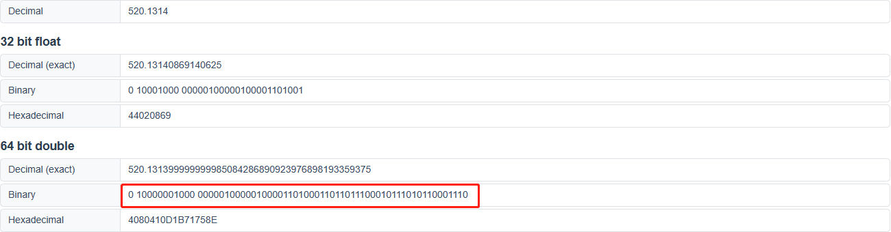

# 浮点数原理
本文将从**浮点数**的经典案例入手，去研究**浮点数的存储原理**、**IEEE754 浮点数标准**、**浮点数转换规则**、**浮点数精度丢失**的相关知识。
## 0.1 + 0.2 === 0.3 ?
在 JS 中，有一个与常识不符的现象，0.1 + 0.2 === 0.3 的结果是 false，也就是说我们在 JS 中看到的小数，是存在精度丢失的，可以通过 toPrecision 函数，来查看实际的数字。例如，0.1的实际存储为 0.1000000000000000055511151231257827021181583404541015625。
```javascript
0.1 + 0.2 === 0.3 // false
0.1.toPrecision(55) // '0.1000000000000000055511151231257827021181583404541015625'
0.2.toPrecision(55) // '0.2000000000000000111022302462515654042363166809082031250'
0.3.toPrecision(55) // '0.2999999999999999888977697537484345957636833190917968750'
```
## 浮点数
在代码中声明的数，会转换成二进制存储在计算机中，**浮点数**是计算机中用来存储小数的一种方式，表示不约定小数点的位置，小数点位置是漂浮不定的，与之对应的是**定点数**。  
浮点数用来表示数的规则如下:
> V = (-1)^S * M * R^E

参数含义如下： 
- S：符号位，取值 0 或 1，决定一个数字的符号，0 表示正，1 表示负
- M：尾数，用小数表示，例如前面所看到的 0.2 * 10^0，0.2 就是尾数
- R：基数，表示十进制数 R 就是 10，表示二进制数 R 就是 2
- E：指数，用整数表示，例如前面看到的 0.2 * 10^0，0 即是指数

## IEEE754 浮点数标准
IEEE754 浮点数标准是 IEEE 组织推出了浮点数标准，这个标准统一了浮点数的表示形式，并提供了 2 种浮点格式：
- 单精度浮点数 float：32 位，符号位 S 占 1 bit，指数 E 占 8 bit，尾数 M 占 23 bit
- 双精度浮点数 float：64 位，符号位 S 占 1 bit，指数 E 占 11 bit，尾数 M 占 52 bit

计算机中的存储方式遵循 IEEE754 浮点数计数标准，即符号（S）、阶码部分（E）、尾数部分（M），可以表示为：
> 1.M * 2^E

双精度浮点数（64位）示例图：
.png "64位示例")

## 数转浮点数
例如，一个数，520.1314，将它转换成二进制浮点数，以64位为例

可以确定的是符号位S一定0，基数一定是2，其整数部分为520，计算为除2取余，过程如下:
|   计算  |  结果  |  余数  |
|  :----: | :----: | :----: |
| 520/2  | 260 | 0 |
| 260/2  | 130 | 0 |
| 130/2  | 65  | 0 |
| 65/2   | 32  | 1 |
| 32/2   | 16  | 0 |
| 16/2   | 8   | 0 |
| 8/2    | 4   | 0 |
| 4/2    | 2   | 0 |
| 2/2    | 1   | 0 |
| 1/2    | 0   | 1 |

计算结果从左往右以此是 1000001000

其小数部分为1314，计算为乘2取整，过程如下:
|   计算  |  结果  |  余数  |
|  :----: | :----: | :----: |
| 0.1314*2  | 0.2628 | 0 |
| 0.2628*2  | 0.5256 | 0 |
| 0.5256*2  | 1.0512 | 1 |
| 0.0512*2  | 0.1024 | 0 |
| 0.1024*2  | 0.2048 | 0 |
| 0.2048*2  | 0.4096 | 0 |
| 0.4096*2  | 0.8192 | 0 |
| 0.8192*2  | 1.6384 | 1 |
| 0.6384*2  | 1.2768 | 1 |
| 0.2768*2  | 0.5536 | 0 |
| 0.5536*2  | 1.1072 | 1 |
| 0.1072*2  | 0.2144 | 0 |
| 0.2144*2  | 0.4288 | 0 |
| 0.4288*2  | 0.8576 | 0 |
| 0.8576*2  | 1.7152 | 1 |
| 0.7152*2  | 1.4304 | 1 |
| 0.4304*2  | 0.8608 | 0 |
| 0.8608*2  | 1.7216 | 1 |
| 0.7216*2  | ...    | ... |

计算结果从左往右以此是 001000011010001101...，是一个无限不循环数

合并结果以后：1000001000.001000011010001101... * 2^0

写成 1.M * 2^E 的格式为：1.000001000001000011010001101... * 2^9 

E 加上偏移位 1023，最终结果位 1023 + 9 = 1032，转换为二进制后 10000001000
> 1023 即二进制的 1111111111，共10位，因为指数也需要考虑正负，所以通过 E-1023 来表示指数位，可表示范围为 [-1023, 1024]  
> 当 E 为 2047 ，即 10000000000 时，指数为 2047 - 1023 = 1024  
> 当 E 为 0 ，即 0 时，指数为 0 - 1023 = -1023  
> 同理，32位 也存在偏移位，为 127，可表示范围位 [-127, 128]

通过专门的转浮点数工具校验一下
> 在线解析AST网址：https://www.toolhelper.cn/Digit/FractionConvert




对比计算结果与工具计算结果：
| 计算方式 |   S  |  E  |  M  |
|  :----:  |        :----:      |       :----:      |       :----     |
|   公式   |          0         |    10000001000    | 000001000001000011010001101... |
|   工具   |          0         |    10000001000    | 0000010000010000110100011011011100010111010110001110 |

虽然没有计算完全部，但经过比对，计算出来的位数与工具计算结果一致。

## 浮点数精度丢失原因
在上面的计算过程中也不难发现，乘2取整的结果，基本上是无限的，而存储的位数确是有限的，此时会截取存储，进而导致了浮点数精度丢失。回到最初的问题，为什么 0.1 + 0.2 === 0.3 是 false？
1. 在 JavaScript 中，所有的 Number 都是以64位的双精度浮点数存储的
2. 浮点数是根据 IEEE754 浮点数标准存储在计算机中
3. 小数部分的转换规则是乘2取整，通常情况下是无限循环数或无限不循环数，而计算机的存储位数为32位和64位，是有限的，存储无限数时会发生截取，必定会有一定的精度损失
4. 不仅 javascript，所有遵循 IEEE 754 规范的语言都是如此