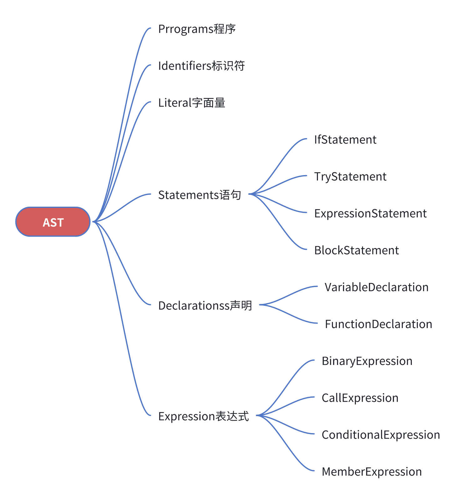
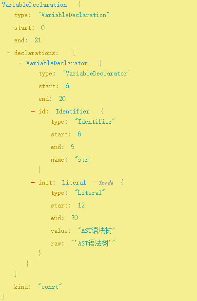

## AST 抽象语法树的定义
抽象语法树 (Abstract Syntax Tree，AST)，是源代码语法结构的一种抽象表示。以**树状的形式**表现编程语言的语法结构，每个节点都表示源代码中的一种结构。
## AST 的节点
在 “AST 的世界”里所有的一切都是节点 (Node)，不同类型的节点之间相互嵌套形成一颗完整的树形结构。

**例子：**
```javascript
const str = 'AST语法树';
```
一句简单的声明，它的AST语法树也会尽可能全面的去描述该语句
> 在线解析AST网址：https://astexplorer.net/

<div align=center></div>

## AST 的转化

<div align=center></div>

1. 解析 (Parse)：将原始代码解析为 AST
2. 转换 (Transform)：遍历源 AST 做转换，生成新的 AST
3. 生成 (Generate)：遍历新的 AST，生成目标代码

## AST 的应用
- 语言转换 Babel、Vue模板语法
- 语法插件 ESlint
- 打包工具插件 代码压缩、树摇tree-shaking