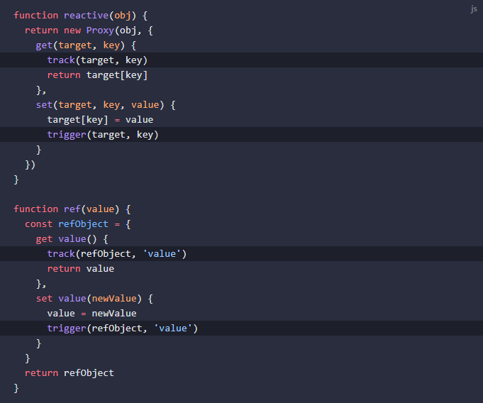

# Vue 响应式原理
本文主要介绍的是 **Vue 的响应式原理**，以及 **Vue2 和 Vue3 实现响应式的方式**。

## 响应式原理
### 响应式
介绍响应式原理，首先需要知道，什么是响应式？响应式解决的是什么问题。先来看一个简单的例子：
```javascript
let A0 = 1
let A1 = 2
let A2 = A0 + A1

console.log(A2) // 3

A0 = 2
console.log(A2) // 仍然是 3
```
当我们更改 A0 后，A2 并不会自动更新，因为 A2 赋值时，A0 是 1 而不是 2，代码是命令式的，一行代码执行一次，如果期望在打印 A2 时使用更新后的 A0，需要再次调用表达式。
```javascript (8)
let A0 = 1
let A1 = 2
let A2 = A0 + A1

console.log(A2) // 3

A0 = 2
A2 = A0 + A1

console.log(A2) // 4
```
如上所示，重新使用表达式，就可以使其变化。但是，有的时候我们希望，这个公式声明一次就够了，也就是说，我们更希望 ***这个公式更想是一个声明式的公式***，声明了该公式后，A2 就可以随着 A0 的变化而变化，而不是每次改动完 A0，就重新调用一次公式，命令式的去更新。

当然，如果将这种思路带到 MVVM 中，也就是 ***视图层渲染出来的数据应该与视图控制层的变量时刻保持一致***，我们会希望，当我们在视图控制层，更改了变量后，视图层可以立刻渲染出变化后的值，也希望当用户在视图层操作了之后，视图控制层可以根据变化做出响应。

所以什么是响应式？***它是一种可以使我们声明式地处理变化的编程范式。当响应式数据发生变化后，执行一系列函数，使得需要变化的部分跟随响应式数据的变化而变化。***

## Vue2 的响应式系统
官方原文：https://v2.cn.vuejs.org/v2/guide/reactivity.html
1. 当你把一个普通的 JavaScript 对象传入 Vue 实例作为 data 选项，Vue 将遍历此对象所有的 property，并使用 ***Object.defineProperty*** 把这些 property 全部转为 getter/setter。
2. 每个组件实例都对应一个 watcher 实例，它会在组件渲染的过程中把“接触”过的数据 property 记录为依赖。之后当依赖项的 setter 触发时，会通知 watcher，从而使它关联的组件重新渲染。


官方的说法略微简单，但是在具体实现上，Vue2 用到了几个核心部件：***Observer***、***Dep***、***Watcher***、***Scheduler***。

### Observer
Observer 要实现的目标非常简单，就是把一个普通的对象转换为响应式的对象。
- Observer 使用 defineReactive 函数 ***把对象的每个属性通过 Object.defineProperty 转换为带有 getter 和 setter 的属性***。
- Observer 只执行一次，在组件生命周期中，这件事发生在 beforeCreate 之后，created 之前。
- Observer 存在一定的局限性，它只能为遍历时的属性添加响应式，无法监测到将来动态增加或删除的属性。
- 为了弥补 Observer 的缺陷，Vue2 提供了 $set 和 $delete 两个实例方法，让开发者通过这两个实例方法对已有响应式对象添加或删除属性。
- 对于数组，Vue2 会重写数组的部分相关方法。主要的原因是数组长度是不确定的，如果数组内容过多，会有严重的性能问题。（只有通过索引更改数据和更改 length 属性是监听不到的，所以重写数组方法不是因为不能监听数组内容）。
    > 性能消耗与带来的用户体验不成正比 - 尤大。
- 当然，Object.defineProperty 方法本身也存在局限性，它只能拦截 get（获取）和 set（设置）这两种基本语义，对于其他的基本语义，例如：in（属性/继承属性查询）、apply（函数调用）等，无法进行拦截。

### Dep
Dep 的含义是 dependency 表示依赖的意思。
- Observer 添加响应式时，会为每一个数据创建一个 Dep 实例。
- Dep 在 getter 中记录依赖（dep.depend）。
- Dep 在 setter 中派发更新（dep.notify）。
- Dep 中存在一个属性 target，通过这个属性将 Observer 与 Watcher 联系起来。
- Dep 中存在一个属性 subs 用于存放被 Watcher 观测的 getter。

### Watcher
Watcher 表示的是观测者，当观测的属性发生变化，执行相对应的函数（getter）。
- Watcher 是一个对象，每个函数执行时都应该创建一个 Watcher，通过 Wacher 去执行。
- Watcher 中存在一个属性 expOrFn，存放的是需要执行的函数，可以是由模板语法解析出来的表达式，或是一个函数，如果是函数，则直接赋值给 getter，如果不是函数，则调用 parsePath 函数转换后再赋值给 getter。
- Dep 在收集依赖的过程中，当函数使用到响应式数据时，响应式数据并不能知道是谁（哪个函数）使用它，因此，Dep 将函数交给 Watcher 去执行。
- Watcher 会使用一个全局变量（Dep.target），让全局变量记录当前负责执行的 Watcher 等于自己，然后再去执行函数，在函数执行的过程中，***如果发生了依赖记录，那么 Dep 就会把这个全局变量记录下来***，表示有一个 wathcer 用到了我这个属性，随后在将这个全局变量置空。
- Watcher 中还存在很多表示如何去执行函数的修饰变量，例如：lazy（懒执行）、dirty（缓存）、deep（深度遍历）、user（判断是不是侦听器 watch 绑定的）、sync（同步标识）等等。
- 当 Dep 进行派发更行时，Watcher 会通知之前记录的所有 getter，将其执行。

### Scheduler
Scheduler 表示的是调度器，它不是一个具体的类，而是函数执行的特殊方法，反应的是函数 getter 该如何执行。
- Scheduler 中含有一个变量 queue，表示任务队列。
- Scheduler 中含有函数 flushSchedulerQueue，表示刷新调度器并执行 Watcher。
- Scheduler 中含有函数 queueWatcher，***它的作用将观察者（Watcher）放入任务队列***。它会根据 flushing 和 waiting 这两个标识来判断是否正在执行任务队列和是否需要等待。它会根据 config.async 异步标识来决定是直接执行任务还是将任务交给 nextTick。

### Vue3 的响应式系统
官方原文：https://cn.vuejs.org/guide/extras/reactivity-in-depth.html
1. Vue3 使用新增的组合式 Api：reactive 和 ref 来将一个值转换成响应式数据。
2. reactive 通过 proxy 为非原始值设置响应式，在 getter 中使用 tarck 函数收集副作用函数，在 setter 中使用 trigger 函数执行副作用函数。
3. ref 则是将原始值包装成一个对象，该含有 value 的 getter 和 setter，再将该对象交给 reactive 处理。
4. 副作用函数将被存储在一个全局的 WeakMap \<target, Map\<key,Set\<effect\>\>\> 数据结构中。target 表示响应式对象，key 表示响应式对象的键名，Set\<effect\> 表示这个键对应的所有副作用函数。


Vue3 使用了 proxy 和 优化数据结构之后，整体的结构变得更清晰。后续将在进阶版中更新 Vue3 的 tarck 函数、 trigger 函数和 reactive 函数。