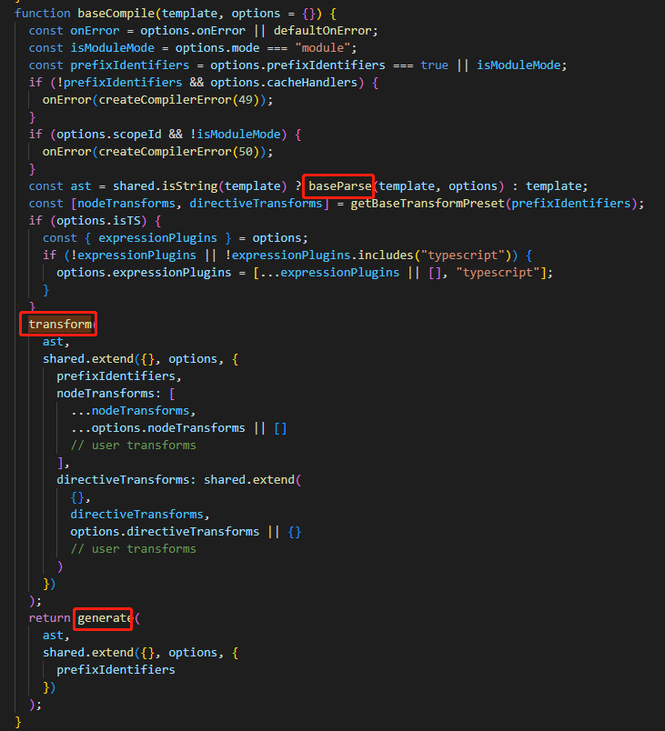

# Vue的模板语法
Vue 存在一个 Compile 模块，用于将 template 转换成 render 函数。本文将探索其如何转换。
## 引子
先思考几个问题
- Vue的语法浏览器能不能识别？
- Vue为什么可以使用双括号语法在HTML中使用变量？为什么原生JS不行？

解答这些问题之前，我们需要先回顾一下Vue的语法

看两个简单的Vue组件，APP和Demo
```vue
<template>
    <span>我是APP组件</span>
    <Demo></Demo>
</template>

<script setup lang="ts">
    import Demo from './components/Demo.vue';
</script>
```
```vue
<template>
    <span>我是Demo组件</span>
    <span>{{ msg }}</span>
</template>

<script setup lang="ts">
    import { ref } from 'vue';
    const msg = ref('我是响应式字符串');
</script>
```
通过这两个例子，Vue的模板语法以template为主，并可以在其中使用JS变量。App组件中导入了Demo组件，本身是一个变量，我们可以尝试打印一下它
```vue
<template>
    <span>我是APP组件</span>
    <Demo></Demo>
</template>

<script setup lang="ts">
    import Demo from './components/Demo.vue';
    console.log(Demo);
</script>
```
Demo打印结果如下：
```javascript
{
    "render": ƒ _sfc_render(_ctx, _cache, $props, $setup, $data, $options),
    "setup": ƒ setup(__props, { expose: __expose }),
    "__name": "Demo",
    "__hmrId": "b0b1deea",
    "__file": "C:/Users/ADMIN/Desktop/lyh/app/music/src/components/Demo.vue"
}
```
其中，发现了一个名为render的函数，在vue2中，可以使用render函数将虚拟Dom渲染成真实Dom，尝试打印render的返回值
```javascript
{
    "__v_isVNode": true,
    "__v_skip": true,
    "props": null,
    "key": null,
    "ref": null,
    "scopeId": null,
    "slotScopeIds": null,
    "children": [
        {
            "__v_isVNode": true,
            "__v_skip": true,
            "type": "span",
            "props": null,
            "key": null,
            "ref": null,
            "scopeId": null,
            "slotScopeIds": null,
            "children": "我是Demo组件",
            "component": null,
            "suspense": null,
            "ssContent": null,
            "ssFallback": null,
            "dirs": null,
            "transition": null,
            "el": null,
            "anchor": null,
            "target": null,
            "targetAnchor": null,
            "staticCount": 0,
            "shapeFlag": 9,
            "patchFlag": -1,
            "dynamicProps": null,
            "dynamicChildren": null,
            "appContext": null,
            "ctx": null
        },
        {
            "__v_isVNode": true,
            "__v_skip": true,
            "props": null,
            "key": null,
            "ref": null,
            "scopeId": null,
            "slotScopeIds": null,
            "children": " <span>{{ msg }}</span>  ",
            "component": null,
            "suspense": null,
            "ssContent": null,
            "ssFallback": null,
            "dirs": null,
            "transition": null,
            "el": null,
            "anchor": null,
            "target": null,
            "targetAnchor": null,
            "staticCount": 0,
            "shapeFlag": 8,
            "patchFlag": 0,
            "dynamicProps": null,
            "dynamicChildren": null,
            "appContext": null,
            "ctx": null
        }
    ],
    "component": null,
    "suspense": null,
    "ssContent": null,
    "ssFallback": null,
    "dirs": null,
    "transition": null,
    "el": null,
    "anchor": null,
    "target": null,
    "targetAnchor": null,
    "staticCount": 0,
    "shapeFlag": 16,
    "patchFlag": 2112,
    "dynamicProps": null,
    "dynamicChildren": [],
    "appContext": null,
    "ctx": null
}
```
可以看出，是一个虚拟Dom对象。所以我们可以知道，***一个模板，经过一定的处理，最终会变成一个render函数***，而render函数的返回值是一个虚拟Dom。接下来，我们继续研究是什么样的处理，让模板变成函数。

通过对Vue的compiler模块的研究，我们能够发现：
- ***其先使用 parse 函数，将模板字符串转换成编译成 vue 的 AST 语法树***
- ***再通过 transform 函数，将vue的AST语法树转换成 JS 的 AST 语法树***
- ***再通过 generate 函数，将JS的AST语法树转化成 render 函数***

简单看一下相关函数的TS
```typescript
// parse 函数
function parse(
    source: string,
    {sourceMap, filename, sourceRoot, pad, ignoreEmpty, compiler}?: SFCParseOptions
): SFCParseResult;
interface SFCParseResult {
    descriptor: SFCDescriptor;
    errors: (CompilerError | SyntaxError)[];
}
interface SFCDescriptor {
    filename: string;
    source: string;
    template: SFCTemplateBlock | null;
    script: SFCScriptBlock | null;
    scriptSetup: SFCScriptBlock | null;
    styles: SFCStyleBlock[];
    customBlocks: SFCBlock[];
    cssVars: string[];
    slotted: boolean;
    shouldForceReload: (prevImports: Record<string, ImportBinding>) => boolean;
}
interface SFCTemplateBlock extends SFCBlock {
    type: 'template';
    ast: ElementNode;
}
interface SFCBlock {
    type: string;
    content: string;
    attrs: Record<string, string | true>;
    loc: SourceLocation;
    map?: RawSourceMap;
    lang?: string;
    src?: string;
}
```
```typescript
// transform 函数
function transform(root: RootNode, options: TransformOptions): void;
```
```typescript
// generate 函数
function generate(ast: RootNode, options?: CodegenOptions & {
    onContextCreated?: (context: CodegenContext) => void;
}): CodegenResult;
interface CodegenResult {
    code: string;
    preamble: string;
    ast: RootNode;
    map?: RawSourceMap;
}
```
```javascript
// transform 函数
function transform(root, options) {
  const context = createTransformContext(root, options);
  traverseNode(root, context);
  if (options.hoistStatic) {
    hoistStatic(root, context);
  }
  if (!options.ssr) {
    createRootCodegen(root, context);
  }
  root.helpers = /* @__PURE__ */ new Set([...context.helpers.keys()]);
  root.components = [...context.components];
  root.directives = [...context.directives];
  root.imports = context.imports;
  root.hoists = context.hoists;
  root.temps = context.temps;
  root.cached = context.cached;
  {
    root.filters = [...context.filters];
  }
}
```
接下来看一下模板语法的主函数baseCompile
<div align=center></div>

